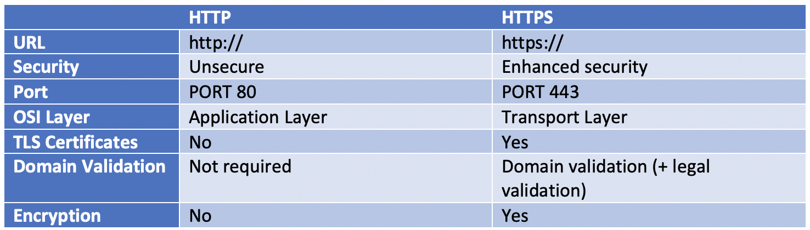

- **difference between authentication & authorization?**

authentication is the process of verifying who someone is, whereas authorization is the process of verifying what specific applications, files, and data a user has access to.

- **Http methods?**

POST, GET, PUT, PATCH, and DELETE.

- **difference between Http & Https?**

[differences-between-http-https](https://www.venafi.com/blog/what-are-differences-between-http-https-0)

- **What is Database transaction?**

A transaction, in the context of a database, is a logical unit that is independently executed for data retrieval or updates

you want to treat as "a whole." It has to either happen in full or not at all.

A classical example is transferring money from one bank account to another. To do that you have first to withdraw the amount from the source account, and then deposit it to the destination account. The operation has to succeed in full. If you stop halfway, the money will be lost, and that is Very Bad.

In modern databases transactions also do some other things - like ensure that you can't access data that another person has written halfway. But the basic idea is the same - transactions are there to ensure, that no matter what happens, the data you work with will be in a sensible state. They guarantee that there will NOT be a situation where money is withdrawn from one account, but not deposited to another.

- **Database Indexing?**

https://stackoverflow.com/questions/1108/how-does-database-indexing-work

https://www.youtube.com/watch?v=zDzu6vka0rQ

- **OOP questions?**

**Object-Oriented Programming** System (OOPs) is a programming concept that works on the principles of **abstraction, encapsulation, inheritance, and polymorphism**. It allows users to create objects they want and create methods to handle those objects. The basic concept of OOPs is to create objects, re-use them throughout the program, and manipulate these objects to get results.

- **what is the difference between state and props?**

e key difference between props and state is that state is internal and controlled by the component itself while props are external and controlled by whatever renders the component.

Props and state are related. The state of one component will often become the props of a child component. Props are passed to the child within the render method of the parent
