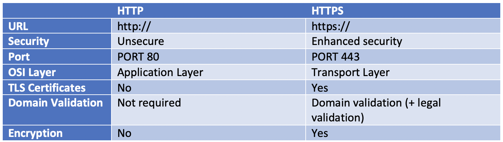

- **what is Http methods?**

  POST, GET, PUT, PATCH, and DELETE.

- **difference between Http & Https?**

  https is more secure

  [differences-between-http-https](https://www.venafi.com/blog/what-are-differences-between-http-https-0)

  

- **why https more secured ?**

  coz it's encrypted.

- **why it's called http?**

  hypertext transfer protocol

- **what do we mean by protocol?**

  A protocol is a system of rules that define how data is exchanged within or between computers.

- **How to send file in request?**

- **How to send params in get request: “query params”?**
